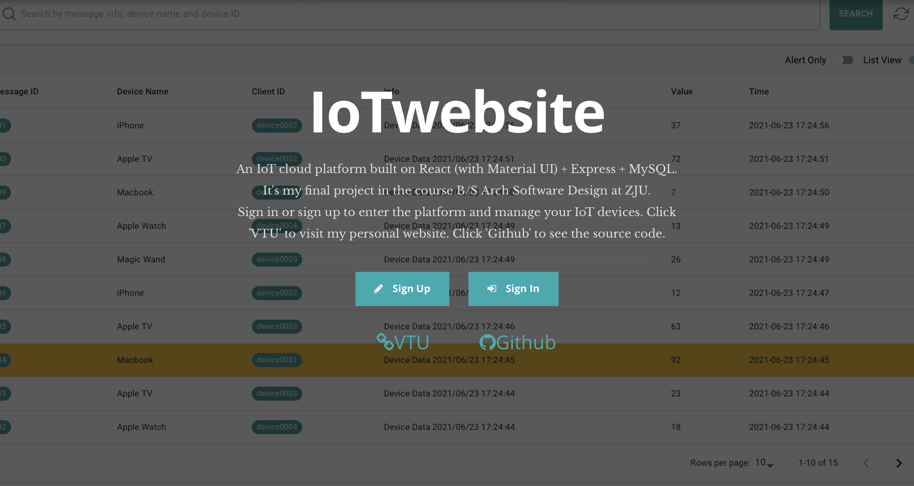
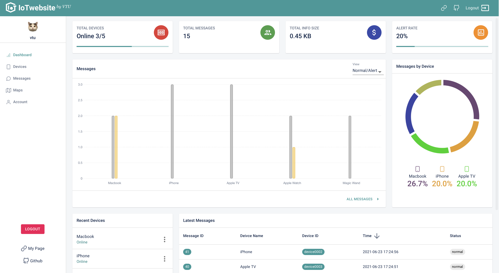
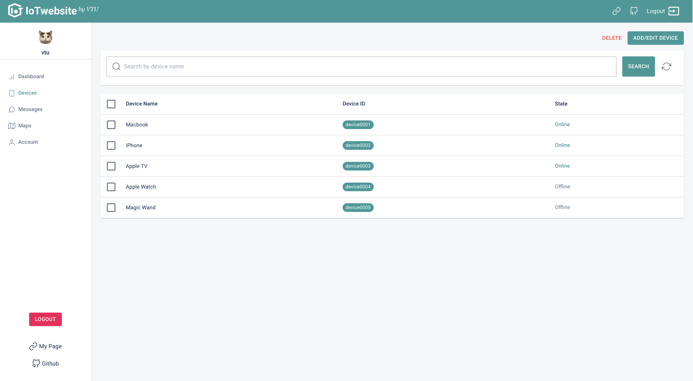
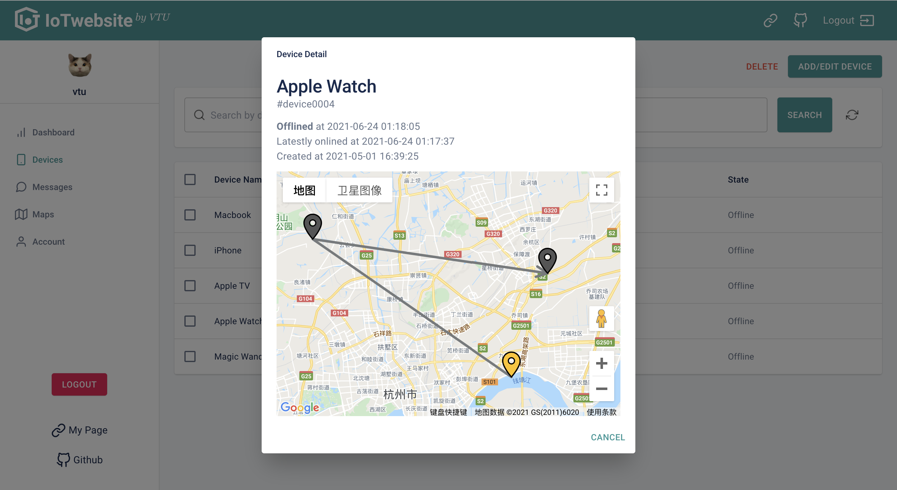
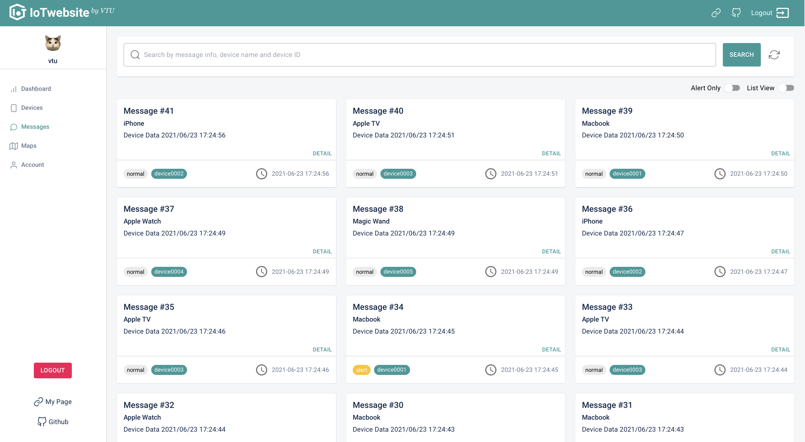
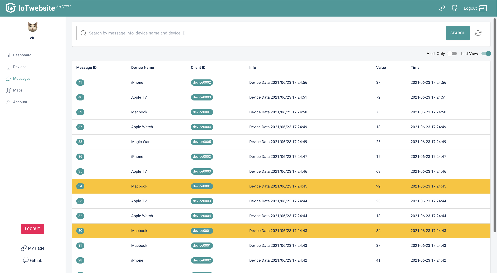
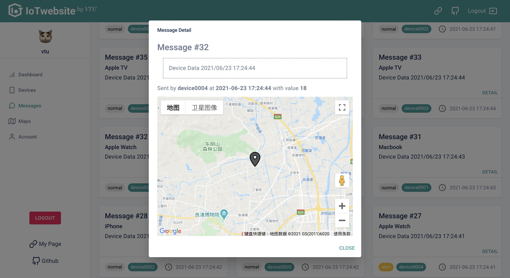
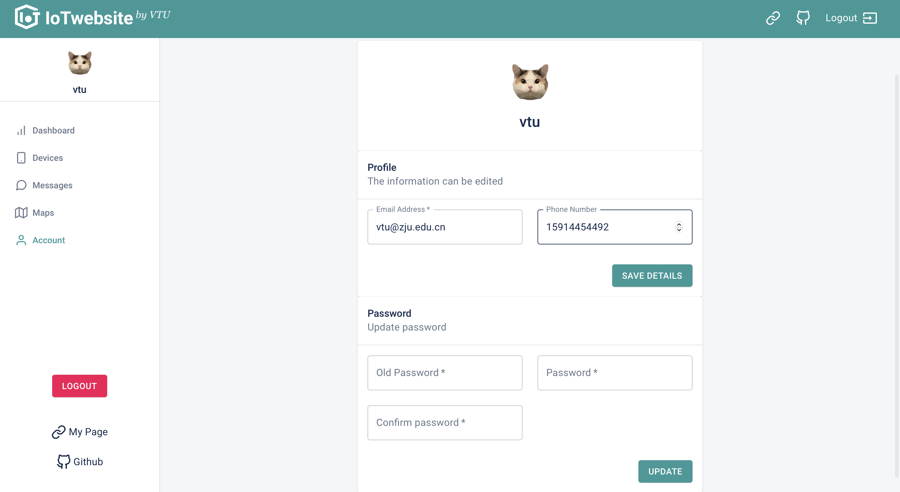
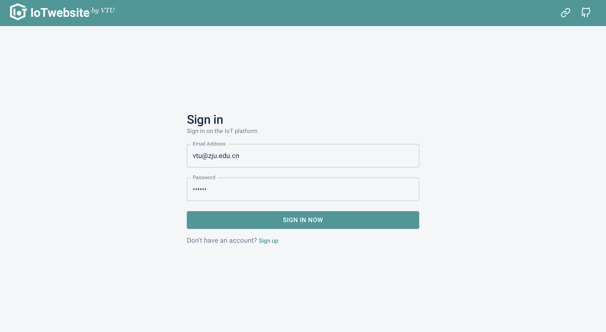
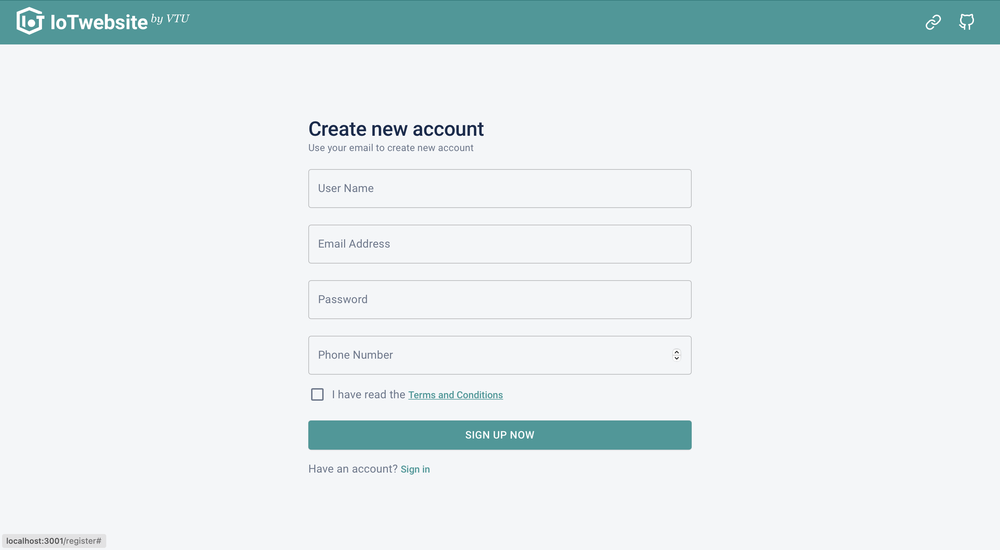

# README


This repository contains my final project for course *B/S Arch Software Design*. The project is an IoT platform website, consisting of a **MQTT server** receiving info from (simulated) devices, a **MySQL server** storing data, an **Express Node.js** backend, a **React** with **Material UI** frontend.

## Demo

Pages' screen shots look like these:






















---

## Quick Setup

### Frontend & Backend

First install dependency with:
```bash
# Under the root directory of the repository
npm install
cd server && npm install && cd ..
```

Start both the frontend and the backend concurrently (in development mode) with:
```bash
# Under the root directory of the repository
npm run whole
```

By default, the frontend runs at localhost:3000, and the backend runs at localhost:3001. You can customized the ports, but do remember to alter `./package.json` at line:

```json
"proxy": "http://localhost:3001", # proxy for the frontend to the backend
```

Well, you should see the home page now :). But it's not done yet! You should also set up the MySQL database, the [EMQX Enterprise](https://www.emqx.cn/products/enterprise) MQTT server, and the simulated IoT client devices for the whole website to work.

### MySQL Server

First create a database named `mqtt`:

```mysql
create database mqtt;
use mqtt;
```

Then set up some necessary tables: 

```mysql
# Table mqtt_client is only for EMQX server to write, and nodejs server to read
CREATE TABLE `mqtt_client` (   `id` int(11) unsigned NOT NULL AUTO_INCREMENT,   `clientid` varchar(64) DEFAULT NULL,   `state` varchar(3) DEFAULT NULL,   `node` varchar(64) DEFAULT NULL,   `online_at` datetime DEFAULT NULL,   `offline_at` datetime DEFAULT NULL,   `created` timestamp NULL DEFAULT CURRENT_TIMESTAMP,   PRIMARY KEY (`id`),   KEY `mqtt_client_idx` (`clientid`),   UNIQUE KEY `mqtt_client_key` (`clientid`),   INDEX topic_index(`id`, `clientid`) ) ENGINE=InnoDB DEFAULT CHARSET=utf8MB4;

# The following 3 tables are for nodejs server to read and write
create table account(
	user_name varchar(30) primary key,
	password_hash varchar(64),
	email varchar(64) unique,
	phone_number varchar(64));

create table device_info(
	clientid varchar(64),
	device_name varchar(64),
	user_name varchar(64),
	primary key (clientid, user_name),
	foreign key (clientid) references mqtt_client(clientid),
 	foreign key (user_name) references account(user_name));

create table message(
  msgid int unsigned primary key auto_increment,
  alert bit,
  clientid varchar(64),
  info varchar(256),
  lat numeric(20, 14),
  lng numeric(20, 14),
  timestamp timestamp,
  value int,
	foreign key (clientid) references mqtt_client(clientid)
);
```

Then set up your MySQL account info at `server/utils/mysql_config.json` (create it if not exist!):

```json
{
    "host"     : "YOUR MYSQL HOST",
    "user"     : "YOUR USER NAME",
    "password" : "PASSWORD",
    "database" : "mqtt",
    "port"     : YOUR MYSQL PORT
}
```

### EMQX Server

Follow the [EMQX official guide](https://docs.emqx.cn/enterprise/v4.3/#开始使用) to set up your EMQX server. Most importantly, remember to enable the `emqx_backend_mysql` plugin to let the MQTT server store device info into the `mqtt` database (check [here](https://docs.emqx.cn/enterprise/v4.3/backend/backend.html#数据存储设计) to see the detail).

Then set up your MQTT config at `server/utils/mqtt_config.json` (create it if not exist!):

```json
{
    "host": "YOUR MQTT HOST"
}
```

Now run `npm run whole` again, the IoT platform should be fully activated. If anything go wrong, check the backend terminal or frontend console for debug info.

### IoT Client

The IoT client devices are simulated by code, lying under `./iotclient`. Follow the README of it:

1. Compile the code with
```bash
mvn clean package
```

2. Run
- Put `iot.properties` at the same directory of `iotclient-1.0.0.jar`.
- Alter `iot.properties` to configure device number and related info.
- Run with
```bash
java -jar iotclient-1.0.0.jar
```
- The simulated clients will automatically subscribe to the specified MQTT server, and keep sending some randomized messages.
